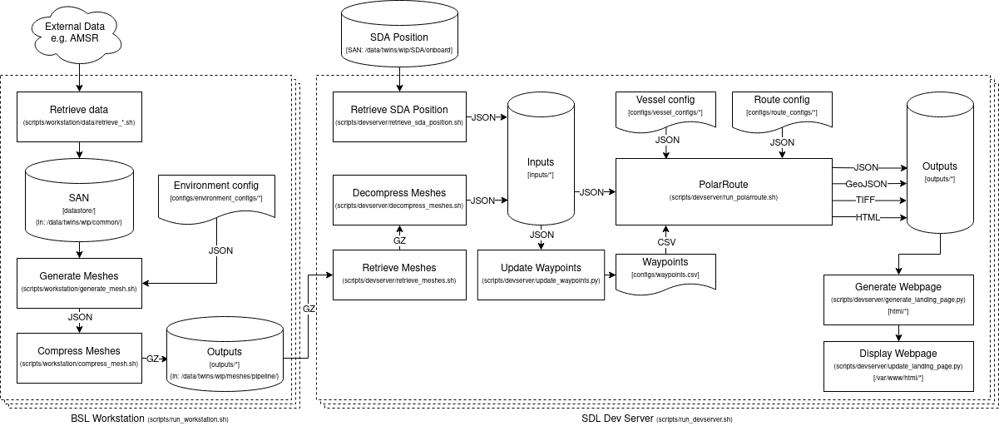

# PolarRoute-pipeline

PolarRoute-pipeline is a data pipeline used to automate the generation of ocean/sea-ice meshes and optimised routes for ocean vessel route-planning. This data pipeline forms part of the BAS Operational PolarRoute (OPR) project.  

User documentation for PolarRoute-pipeline can be found [here](https://antarctica.github.io/PolarRoute-pipeline/).

##  

# Process


The Operational PolarRoute project has been split up into two distinct parts in order to minimise the size of the data transfer required from shoreside to shipside.

1. **PolarRoute-pipeline (this repo)** Required data products are downloaded, stored and processed shoreside where the data and compute resources are abundant. This generates ocean/sea-ice meshes (and routes if required) for areas of operational interest. These generated outputs are compressed and transferred via satellite (or other) link to shipside.

1. **PolarRoute-server** Once the meshes are available shoreside they are ingested into an onboard database which allows them to be displayed digitally. The meshes are used to provide point-to-point optimised routes which are calculated on demand and presented to the onboard user digitally. PolarRoute-server handles the onboard mesh generation and negotiations through the user interface.

From the two distinct parts defined above, this repo is concerned only with part (1.)  

##  

# Implementation
During 2024 the previous repository was manually ported from a hierarchy of bash and python scripts to an implementation using a workflow manager. The original scripts remained mostly unchanged although the introduction of the [Jug](https://jug.readthedocs.io/en/latest/) parallelisation package allowed the scripts to execute with strict dependency, monitoring and pipeline control. This was initially achieved using a handbuilt workflow manager script `operational-polarroute.py`.  
  
**September 2024 onwards:** The workflow manager concept was rebuilt as a separate and generic workflow manager forming the package [simple-action-pipeline](https://github.com/antarctica/simple-action-pipeline). PolarRoute-pipeline was then ported to being a configuration of *simple-action-pipeline*.

##  

# Installing the pipeline

## Setting up the virtual environment
The pipeline requires Python 3.8 or higher and it is recommended to use a python virtual environment to reduce the risk of any package conflicts.

### BAS HPC Workstation or Local PC

1. Create a Python virtual environment with Python 3.8 or higher (3.12 used for development).
    
    - check available Python with `python --version`
    - if required, install a compatible python version
    - then `python -m venv <path-to-venv>`
> To get a python version > 3.8 on a BAS HPC workstation
>   - if required, load a compatible python version `module load hpc/python/conda-python-3.x.x`
>   - then `python -m venv <path-to-venv>`
>   - Unload the python module `module unload hpc/python/conda-python-3.x.x`
> 
> See `https://ictdocs.nerc-bas.ac.uk/index.php/HPC:VirtualEnvs` for more information. The only diversion from these instruction is to load in a version of Python >= 3.8 to create the venv.

1. Source the new newly created python venv
    - `source <path-to-venv>/bin/activate` (Assuming you're using Bash or similar. Use the appropriate activate script within that folder depending on your shell)

1. Clone this repository
    - Assuming you have already cloned this repository into a directory, move into the 'root' of this repository.
    - Otherwise `git clone https://github.com/antarctica/PolarRoute-pipeline.git polarroute-pipeline`
    - then `cd polarroute-pipeline`

1. Install requirements via pip (inside the created venv)
    - `python -m pip install -r requirements.txt`

##  

## Setting up the pipeline
1. Assuming you have already cloned this repository into a directory on a BAS HPC Workstation or Local PC, move into the 'root' of the repository. `cd polarroute-pipeline`

2. Create symbolic links for the venv activation script, datastore (where downloaded data products are to be stored), outputs (where the generated outputs are to be stored) and upload (where outputs are copied to be sent shipside).
    - `ln -s <path-to-venv>/bin/activate <path-to-this-repo>/activate`
    - `ln -s <path-to-datastore> <path-to-this-repo>/datastore`
    - `ln -s <path-to-logs-directory> <path-to-this-repo>/logs`
    - `ln -s <path-to-output-archive> <path-to-this-repo>/outputs`
    - `ln -s <path-to-upload-directory> <path-to-this-repo>/upload`
    - If you wish to internally publish one or more static html versions of the pipeline output then you can also create a symbolic link to where the statis html will be hosted from.  
    `ln -s <path-to-html-directory> <path-to-this-repo>/html`  


## Setting up download credentials
PolarRoute-pipeline will need to use valid credentials to download ERA5 and DUACS products, ensure you have these set up as detailed below:

### ERA5
The ERA5 downloader scripts make use of the CDS API (via the cdsapi python package) and require you to create a .cdsapirc file in your home directory ($HOME/.cdsapirc) containing a valid url and key for the API as described here: https://cds.climate.copernicus.eu/api-how-to  

From a shell:
``` bash
echo url: https://cds-beta.climate.copernicus.eu/api > $HOME/.cdsapirc
echo key: <your-unique-api-key> >> $HOME/.cdsapirc
echo verify:0 >> $HOME/.cdsapirc
```

### Copernicus Marine API
The Copernicus API to is used to download up-to-date DUACS currents data. This service requires obtaining a USERNAME and PASSWORD for logging in. Once you have the username and password they can be stored separately to the pipeline in the user's `HOME` directory. You can register on the [Copernicus Marine API Registration](https://data.marine.copernicus.eu/register) page.
``` bash
mkdir -p $HOME/.copernicusmarine
echo <your-unique-username> > $HOME/.copernicusmarine/user
echo <your-unique-password> > $HOME/.copernicusmarine/password
```
 - The above commands will create the required credentials files. If you wish to remove the details of these commands in your shell's history, you can perform the following:  
   1. Logout *(this will flush your shell history to ~/.bash_history)*
   1. Login
   1. ` cat /dev/null > ~/.bash_history ` *(this will erase all of your bash history)*

## Build the pipeline

## `build`
To build the pipeline from `pipeline.yaml` and `application.yaml`, run the command:  

- *make sure your virtual environment is activated*  
  *`source <path-to-this-pipeline-directory>\activate`*   

From a shell: 
```bash
pipeline build <path-to-this-pipeline-directory>
``` 

##  

**The pipeline install and setup is finished.**

##  

# Running the pipeline

*Note: Running the pipeline command from within a pipeline directory does not require specifying the `<path-to-pipeline-directory>`, because if this argument is missing the current directory is assumed to be the pipeline.*  

It's useful to check that the pipeline is installed and setup correctly. This can be done by running the pipeline's `status` command:

In a shell:
``` bash
pipeline status <path-to-this-pipeline-directory>
# or the short version
pipeline status <path-to-this-pipeline-directory> --short
```
A long (or short) report should be output. This `status` script can be run at any time and will give the 'live' state of the pipeline and it's tasks.

## `status`
As shown above the status of the pipeline can be queried at any time. The status command handles sourcing the pipeline's `pipeline.env` and `application.env` files and so these need not be performed prior to running the script.  

Check the status by running the command:
```bash
pipeline status <path-to-this-pipeline-directory> {--short}
```

The status of the pipeline is available before, during and after pipeline execution. The status of the pipeline is maintained indefinitely after the execution is completed, which is useful for querying long after the pipeline has completed. This holds true if the pipeline fails for any reason.  

## `execute`
To start the pipeline, run the command:
```bash
pipeline execute <path-to-this-pipeline-directory>
``` 

## `reset`
Because the statefulness of the pipeline persists even after completion an additional step is required before the pipeline is executed again. This is called a 'reset' and when initiated, the workflow manager erases the state of the pipeline ready for re-execution.  

A reset can be performed by running the command:
```bash
pipeline reset <path-to-this-pipeline-directory>
```

Resetting a running pipeline is not advised and may produce unpredictable behaviour (please refer to `halt` below).  

## `halt`
If the pipeline needs to be halted whilst it is running, the 'halt' command has been provided.  
```bash
pipeline halt <path-to-this-pipeline-directory>
```

This does not erase the statefulness of the pipeline, so the 'status' command can be used after halting has occured. Any pipeline tasks that have already completed will remain so, although any tasks which haven't fully completed will revert to being not started.  

Following a 'halt' there are two possible choices:  

1. `execute` will resume the pipeline from where it was halted.
1. `reset` will reset the pipeline to it's un-executed state.

##  

# Behind the scenes

All of the pipeline scripts **except 'halt'** automatically initialise the pipeline by sourcing the pipeline and application environment files. This happens every time a command is run. If changes are made to either of the yaml configuration files the pipeline must be re-built for those changes to take effect.

The workflow manager is a parallelised python script `workflow-fmanager/<name-of-pipeline>.py` used by **Jug**. This python script sets out which scripts execute and in which dependency-driven order.

## Operational PolarRoute workflow

One feature of **Jug** is that it can generate a graphical representation of the pipeline's workflow, allowing it to be checked by the user:  
```bash
source activate
source pipeline.env
source application.env
jug graph workflow-fmanager/<name-of-pipeline>.py
deactivate
```
> Open the file `workflow-fmanager/<name-of-pipeline>.png` to see how the pipeline functions. This will also clearly demonstrate the polarroute tasks and their dependencies.   

## Logs
Logs of stderr and stdout are stored in `logs/<config_name>_<date>.err` and `logs/<config_name>_<date>.out` for debugging purposes. 
