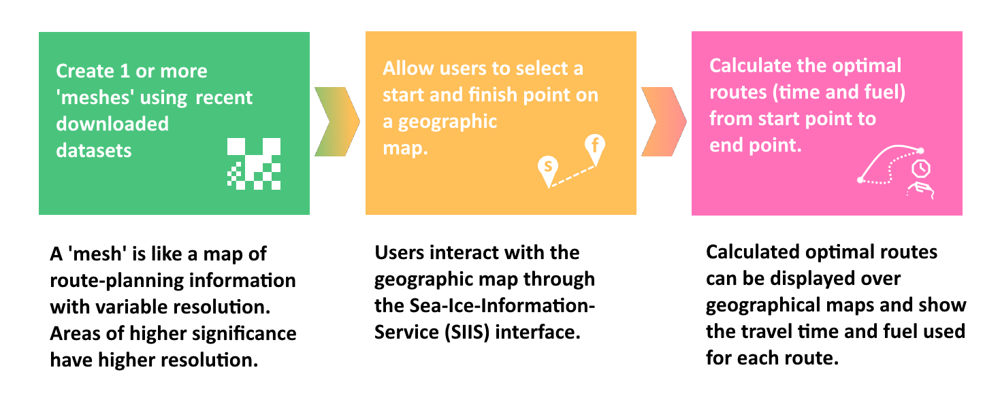

# PolarRoute-pipeline

PolarRoute-pipeline is a data pipeline used to automate the generation of ocean/sea-ice meshes and optimised routes for ocean vessel route-planning. This data pipeline forms part of the BAS Operational PolarRoute (OPR) project.  

User documentation for PolarRoute-pipeline can be found [here](https://bas-amop.github.io/PolarRoute-pipeline/).

##  
  
## Basic process flow diagram of Opertional PolarRoute

  
PolarRoute-pipeline implements the first step (left-most) in the above diagram.

##  

# Installing the pipeline

It is recommended to use a Python virtual environment to reduce the risk of any Python package conflicts.

### HPC Workstation or Local PC

1. **Create a Python virtual environment**  
   The Python version must be **Python 3.9** or higher (3.12 was used during development).
    
    - Check the available Python with `python --version`
    - If required, install or load a compatible python version. Your HPC administrator will be able to help with getting a compatible Python version.
    - then `python -m venv <path-to-venv>` with a path of your choosing.

1. **Source the new newly created python venv**  
    - `source <path-to-venv>/bin/activate` (Assuming you're using Bash or similar. Use the appropriate activate script within that folder depending on your shell)

1. **Clone this repository**
    - Assuming you have already cloned this repository into a directory, move into the 'root' of this repository. `cd polarroute-pipeline`.
    - Otherwise `git clone https://github.com/bas-amop/PolarRoute-pipeline.git polarroute-pipeline`
    - then `cd polarroute-pipeline`

1. **Install requirements**  
    - Using python pip (inside the created venv) `python -m pip install -r requirements.txt`

##  

# Setting up the pipeline

Even before the pipeline can be built for the first time, there are a number of one-time setup steps required.

1. Assuming you have already created a Python virtual environment and cloned this repository into a directory on a HPC Workstation or Local PC, move into the 'root' of the repository.  
`cd polarroute-pipeline`  

2. Create symbolic links for the venv **activation** script, **datastore** (where downloaded data products are to be stored), **logs**,  **outputs** (where the generated outputs are to be stored), **html** (for the summary status page) and **upload** + **push** (where outputs are copied to be sent shipside).
    - `ln -s <path-to-venv>/bin/activate <path-to-this-repo>/activate`
    - `ln -s <path-to-datastore> <path-to-this-repo>/datastore`
    - `ln -s <path-to-logs-directory> <path-to-this-repo>/logs`
    - `ln -s <path-to-output-archive> <path-to-this-repo>/outputs`
    - `ln -s <path-to-upload-directory> <path-to-this-repo>/upload`
    - `ln -s <path-to-push-directory> <path-to-this-repo>/push`
    - `ln -s <path-to-html-directory> <path-to-this-repo>/html`  

The links created above are specific to PolarRoute-pipeline as various data products are stored in differen't remote or local directories. If you are setting up a completely local instance of PolarRoute-pipeline then you could just create local folders within the pipeline directory, instead of links to external locations. Below is an explanation of why each link/directory is required:  

| Directory or Link | Purpose |
|--|--|
| `<pipeline>/activate` | So the pipeline knows which activation script to use |
| `<pipeline>/datastore` | Where to store and retrieve downloaded source datasets |
| `<pipeline>/logs` | Where to keep any log files |
| `<pipeline>/outputs` | Where to store and retrieve daily pipeline output products |
| `<pipeline>/upload` | Where to 'prepare' specific outputs before being sent |
| `<pipeline>/push` | Where to place any outputs to be sent. Specifically, the pipeline copies output products from the `upload` directory into the `push` directory. These are then picked up by an external synchronisation system which 'pulls' the products and automatically removes them from the `push` directory afterwards |
| `<pipeline>/html` | Where the pipeline publishes a static html summary page |

## Setting up download credentials
PolarRoute-pipeline will need to use valid credentials to download ERA5 and DUACS products, ensure you have these set up as detailed below:

### ERA5
The ERA5 downloader scripts make use of the CDS API (via the cdsapi python package) and require you to create a .cdsapirc file in your home directory ($HOME/.cdsapirc) containing a valid url and key for the API as described here: https://cds.climate.copernicus.eu/api-how-to  

From a shell:
``` bash
echo url: https://cds-beta.climate.copernicus.eu/api > $HOME/.cdsapirc
echo key: <your-unique-api-key> >> $HOME/.cdsapirc
echo verify:0 >> $HOME/.cdsapirc
```

### Copernicus Marine API
The Copernicus API to is used to download up-to-date DUACS currents data. This service requires obtaining a USERNAME and PASSWORD for logging in. Once you have the username and password they can be stored separately to the pipeline in the user's `HOME` directory. You can register on the [Copernicus Marine API Registration](https://data.marine.copernicus.eu/register) page.
``` bash
mkdir -p $HOME/.copernicusmarine
echo <your-unique-username> > $HOME/.copernicusmarine/user
echo <your-unique-password> > $HOME/.copernicusmarine/password
```
 - The above commands will create the required credentials files. If you wish to remove the details of these commands in your shell's history, you can perform the following:  
   1. Logout *(this will flush your shell history to ~/.bash_history)*
   1. Login
   1. ` cat /dev/null > ~/.bash_history ` *(this will erase all of your bash history)*

Now that everything is set up, the *PolarRoute-pipeline* can be used. Please refer to the [Using the pipeline](https://bas-amop.github.io/PolarRoute-pipeline/using) section of the user documentation for details of how to operate the pipeline.


# Behind the scenes

For information about how the pipeline works, please refer to the user documentation [How PolarRoute-pipeline works](https://bas-amop.github.io/PolarRoute-pipeline/how-polarroute-pipeline-works).
